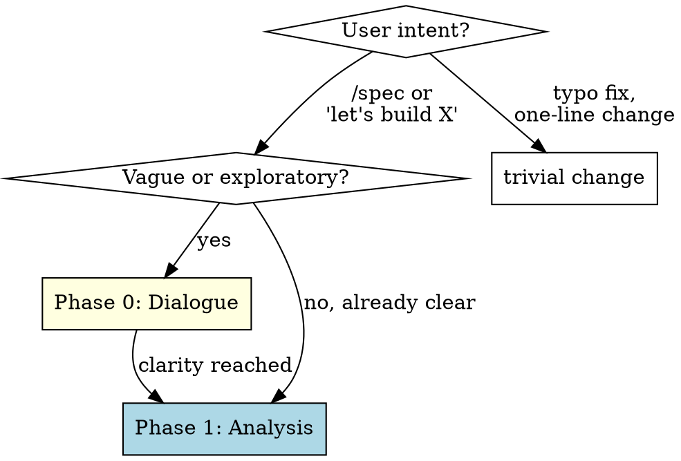

# Spec-Driven Development

## Overview

Transforms any feature idea — vague or well-defined — into a structured specification through codebase analysis, then generates an implementation plan. Adapts to how clear the input is: starts with dialogue for exploratory ideas, skips straight to analysis for well-defined tasks. Always produces a spec artifact as a first-class repo document.

## When to Use



**When NOT to use:**
- Trivial changes (typo fixes, one-line changes) → just do it directly
- When a spec already exists and is approved → go straight to `fulcrum:writing-plans`

---

## Phase 0: Clarity Check (adaptive)

**Skip this phase if the input is already well-defined.**

For vague or exploratory inputs, use dialogue to reach clarity before touching the codebase:

1. Check current project state (files, docs, recent commits) for context
2. Ask questions **one at a time** to refine the idea
   - Prefer multiple-choice when possible
   - Focus on: purpose, constraints, success criteria
3. Propose **2-3 approaches** with trade-offs — lead with your recommendation and explain why
4. Continue until the goal is specific enough to analyze

**YAGNI ruthlessly** — remove unnecessary scope from the design before moving on.

When clarity is reached, transition to Phase 1 and announce it:
> "I have enough to start the codebase analysis. Moving to spec generation."

---

## Phase 1: Codebase Analysis + Spec Generation

### Step 1: Accept Input

Use the goal as established in Phase 0 (or from the user's initial prompt if well-defined). If neither, ask:

> What do you want to build? Describe the feature, bugfix, or change in plain language.

### Step 2: Codebase Analysis

Before writing anything, analyze the existing codebase to ground the spec in reality:

1. **Impact analysis** — Identify which files and modules are likely affected. Use glob and grep to find relevant code. Check imports, dependencies, and call sites.

2. **Pattern discovery** — Examine the affected areas for:
   - Naming conventions (how are similar things named?)
   - Architecture patterns (how is similar functionality structured?)
   - Test patterns (how are similar features tested?)
   - Error handling patterns (how do adjacent modules handle errors?)

3. **Recent change analysis** — Run `git log` on affected files to understand:
   - Who has been working in these areas recently?
   - What kinds of changes have been made?
   - Are there any in-progress changes that might conflict?

4. **Enterprise context** — Load relevant company standards via `fulcrum:enterprise-context` for the spec phase (architecture + coding-standards + security).

### Step 3: Generate Spec Document

Create a structured spec document at `docs/specs/YYYY-MM-DD-brief-description.md`:

```markdown
# Task Specification: [Title]

**Created:** YYYY-MM-DD
**Status:** Draft

## Goal
[One sentence describing what needs to happen]

## Context
[Codebase state, relevant architecture, recent changes in affected areas.
Include specific file paths and patterns discovered in Step 2.]

## Requirements
- [ ] Requirement 1
- [ ] Requirement 2
- [ ] ...

## Constraints
- [Technical constraints discovered from codebase analysis]
- [Enterprise standards that apply (from company config)]

## Impact Analysis
### Files to Modify
- `path/to/file.ts` — [what changes and why]

### Files to Create
- `path/to/new-file.ts` — [purpose]

### Files to Delete
- (none expected)

## Out of Scope
- [Explicit exclusions — what this task does NOT include]

## Risks
- [Identified risks and mitigations]
```

### Step 4: Present for Review

Present the spec in digestible sections — do NOT dump it all at once:

1. **Goal + Context** — "Here's what I understand you want and the current state"
2. **Requirements** — "Here are the specific requirements I derived"
3. **Impact Analysis** — "Here are the files that will be affected"
4. **Constraints + Risks** — "Here are the constraints and risks I identified"
5. **Out of Scope** — "Here's what I'm explicitly excluding"

After each section, pause for the engineer to confirm, modify, or expand.

### Step 5: Iterative Refinement

The engineer can:
- Modify any section
- Add requirements or constraints
- Challenge the impact analysis
- Ask for alternatives ("what if we did X instead?")
- Remove items from scope

Continue iterating until the engineer explicitly approves the spec. When approved, update the spec status to `Approved`.

**Record the stage transition:**
```
Append to .claude/workflow-state.jsonl: {"stage":"spec","action":"entered","timestamp":"<ISO8601>"}
```
When the spec is approved:
```
Append to .claude/workflow-state.jsonl: {"stage":"spec","action":"completed","timestamp":"<ISO8601>"}
```

---

## Phase 2: Plan Generation

Once the spec is approved, delegate immediately to the standard planning skill:

> "Spec approved. Moving to plan generation."

**REQUIRED SUB-SKILL:** Use `fulcrum:writing-plans` to generate the implementation plan from the approved spec document.

Pass the spec file path as context so writing-plans can reference it directly.

---

## The Spec is a First-Class Artifact

The spec document is NOT disposable:

- **Lives in the repo** alongside the code at `docs/specs/`
- **Gets committed** with the implementation
- **Serves as documentation** of intent for future maintainers
- **Enables compound learning** — compare what was specified vs. what was actually built
- **Provides traceability** from spec → plan → implementation → PR

When the implementation is complete, update the spec status from `Approved` to `Implemented`.

---

## Integration

- **REQUIRED:** Use `fulcrum:enterprise-context` during spec generation to incorporate company standards
- **DELEGATES TO:** `fulcrum:writing-plans` immediately after spec approval (Phase 2)
- **FEEDS INTO:** `fulcrum:compound-learning` for post-cycle knowledge capture

---

## Verification Checklist

Before considering the spec phase complete:
- [ ] Codebase analysis was performed (not just the user's description)
- [ ] All sections of the spec are filled in with specific details
- [ ] Impact analysis references actual file paths in the codebase
- [ ] Constraints include relevant enterprise standards
- [ ] Out of scope is explicitly defined
- [ ] Engineer has explicitly approved the spec
- [ ] Spec document is saved to `docs/specs/`
- [ ] Spec status is updated to `Approved`
- [ ] Stage transition recorded to `.claude/workflow-state.jsonl`
